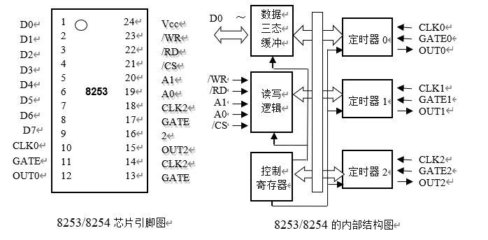
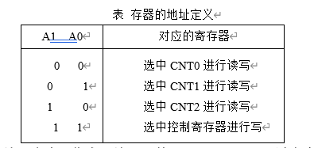
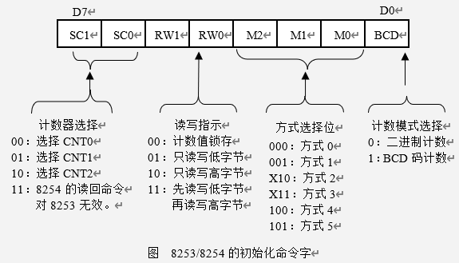
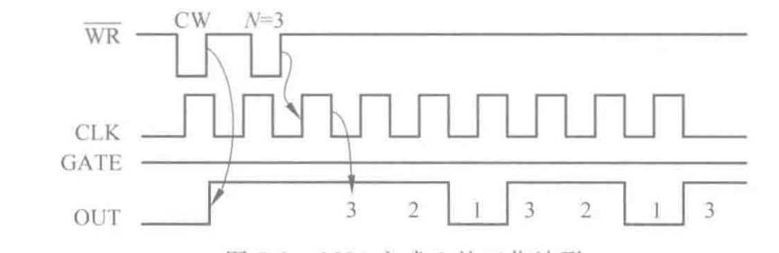
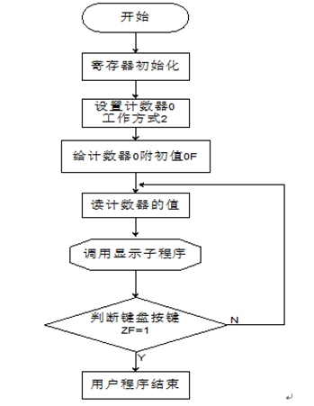
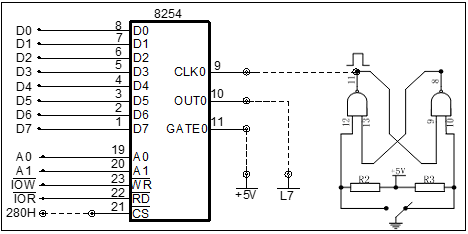
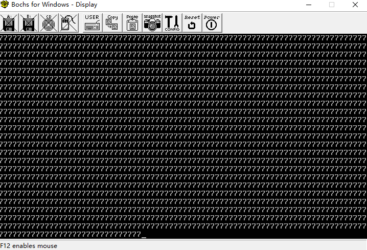
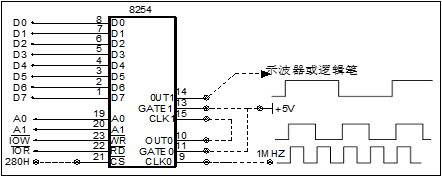

---

**班级：计科2005**     **姓名：熊舟桐**    **学号：202012143**   **班级序号：200523**

**实验日期：2023.4.6**   **学院：计工学院      专业：计算机科学与技术**      

**实验顺序：2**     **实验名称：8253定时器计数器实验**  **指导教师：** **张旭**

---

## 8253定时器计数器实验

### 实验目的

掌握 8253 计数特点和编程方法。掌握 8253 工作方式 3 的基本工作原理、计数特点和编程方法

### 实验环境

`Tpc-zk-II`集成开发环境

微机原理与接口技术实验箱

### 实验原理

8253/8254 内部结构

- 三个16位**减一**计数单元
- 控制寄存器

8253 芯片结构示意图



各地址信号组合功能



8253/8254 的编程命令：作为可编程器件，8253/8254是通过命令字来控制其工作方式的，命令字有两类

- 初始化编程命令：用于设定计数器的功能、工作方式；
- 锁存读出命令：用于读出计数器中的计数值，或计数器的状态（8254）

8253/8254 的初始化控制字



8253 具有三个计数器`CNT0、CNT1、CNT2`，还有一个控制寄存器，它们各占一个地址（由引脚A1、A0确定）；在每一个计数器`CNTi`中，有三个部分构成，初值寄存器`CR`、减一计数器`CE`和输出锁存器`OL`	



8253/8254 的初始化编程：初始化编程操作的顺序是：先想控制寄存器写入命令字，然后写入初值。如果是 16 位初值时，必须是先写入低 8 位初值，然后再写入高 8 位初值，最后输出锁存命令（读计数器的计数值），将当前的计数器的计数值捕捉到输出锁存器`OL`中

### 实验步骤及分析

#### 计数实验

实验流程



编写汇编代码程序

```assembly
data segment
	io0 equ 280h
	io1 equ 281h
	io2 equ 282h
	iok equ 283h
data ends
code segment
assume cs:code,ds:data
start:
	mov ax,data
	mov ds,ax
	mov dx,iok
	mov al,14h
	out dx,al
	mov dx,io0
	mov al,9
	out dx,al
	r1:mov dx,io0
	in al,dx
	call dis
	mov ah,1
	int 16h
	jz r1
	mov ah,4ch
	int 21h
	dis proc
	push ax
	push dx
	add al,30h
	mov dl,al
	mov ah,2
	int 21h
	pop dx
	pop ax
	ret
	dis endp
	here:jmp here
code ends
end start
```

按图连接电路，将计数器0设置为方式2，计数器初值为N（N<=0FH），用手逐个输入单脉冲，编程使计数值在屏幕上显示，用逻辑笔观察OUT0电平变化（当输入N+1个脉冲后OUT0变高电平）



| 接线       |                           |
| ---------- | ------------------------- |
| 8254/CLK0  | 单脉冲/正脉冲             |
| 8254/CS    | I/O译码/Y0（280H---287H） |
| 8254/OUT0  | LED显示/L7 或 逻辑笔      |
| 8254/GATE0 | +5V                       |

点击运行，记录计数过程



#### 定时实验

编写汇编代码程序

```assembly
data segment
io0 equ 280h
io1 equ 281h
io2 equ 282h
iok equ 283h
data ends
code segment
assume cs:code,ds:data
start:
    mov ax,data
    mov ds,ax
    mov dx,iok
    mov al,36h
    out dx,al
    mov dx,io0
    mov ax,1000
    out dx,al
    mov al,ah
    out dx,al
    mov dx,iok
    mov al,76h
    out dx,al
    mov dx,io1
    mov ax,1000
    out dx,al
    mov al,ah
    out dx,al
here:jmp here
code ends
end start
```

按下图 连接电路，将计数器0、计数器1分别设置工作方式，CLK0连接时钟1MHZ，由  T01000分频后变为1000HZ，再由T1进行1000分频后得1HZ



| 接线             |                           |
| ---------------- | ------------------------- |
| 8254/CLK0        | 时钟/1MHz                 |
| 8254/CS          | I/O译码/Y0（280H---287H） |
| 8254/OUT0        | LED显示/L7 或 逻辑笔      |
| 8254/GATE0,GATE1 | +5V                       |
| 8254/OUT1        | 逻辑笔                    |

运行程序，可以看到指示灯如下描述闪烁：高低电平每变化一次，计数加一，计数由两位二进制组成，如

- 在`0`时刻，计数为`00`，两个指示灯均暗
- 在`1`时刻，高低电平变化，计数变为`01`，第一个指示灯暗，第二个指示灯亮
- 在`2`时刻，高低电平变化，计数为`10`，第一个指示灯亮，第二个指示灯暗
- 在`3`时刻，计数为`11`，两个指示灯均亮
- 在`4`时刻，计数为`00`，两个指示灯均暗

### 实验心得

经过本次实验，我基本掌握了 8253 计数特点和编程方法，掌握了 8253 工作方式 3 的基本工作原理、计数特点和编程方法
